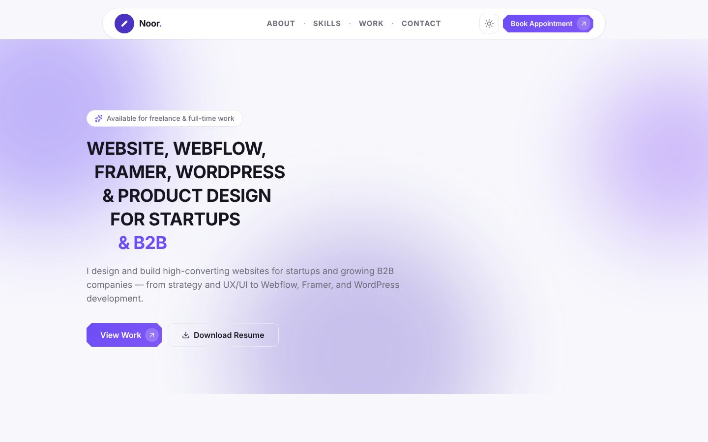

<div align="center">

# Noor Hossain — UI/UX Designer & Front-End Developer Portfolio

Personal portfolio website of **Noor Hossain**, a UI/UX designer and front-end developer from Dhaka, Bangladesh — designing and building high-converting websites for startups and B2B companies with **Next.js, Webflow, Framer and WordPress**.

[](https://personal-porfolio-smoky-seven.vercel.app)




</div>

## ✨ Highlights

- ✅ **Token-driven design system** — every colour, type, spacing, radius, shadow and motion value lives in design tokens (W3C DTCG format, Tokens Studio–compatible)
- ✅ Light / dark theme toggle
- ✅ About, Skills, Work (case studies) and Contact sections with booking CTA
- ✅ Subtle, reduced-motion-aware animations with Framer Motion
- ✅ Validated contact form (React Hook Form + Zod)
- ✅ Self-contained, documented components — easy for any developer to restyle or extend
- ✅ Fast, responsive and SEO-friendly, deployed on Vercel

## 💼 Hire me

Available for **freelance & full-time** work: UI/UX design, Figma-to-code, landing pages, SaaS websites, Webflow, Framer and WordPress.

[](https://www.linkedin.com/in/noorxtk/)
[](https://www.behance.net/noorxtk)
[](https://dribbble.com/Noorxtk)
[](https://github.com/nooruiux)

---

## Tech stack

| Concern        | Choice |
| -------------- | ------ |
| Framework      | Next.js 16 (App Router) + TypeScript |
| Styling        | Tailwind CSS v3, configured to **consume** design tokens |
| Design tokens  | `design-system/tokens.json` (W3C DTCG format, Tokens Studio–compatible) |
| Icons          | `lucide-react` (UI glyphs) + `simple-icons` via `BrandIcon` (social/brand marks) |
| Animation      | Framer Motion (subtle, reduced-motion aware) |
| Forms          | React Hook Form + Zod |
| Deployment     | Vercel |

> **Version note:** the original brief specified Next.js 14, then 15. `create-next-app`
> now ships **16**, which is the current stable — the project was built on it and the
> scaffold matches what a fresh `create-next-app` produces today.

---

## Run locally

```bash
npm install
npm run dev
```

Open http://localhost:3000. `npm run dev` / `npm run build` automatically
regenerate tokens first (`predev` / `prebuild` hooks).

| Script            | Does |
| ----------------- | ---- |
| `npm run dev`     | Dev server (Turbopack) |
| `npm run build`   | Production build |
| `npm run tokens`  | Regenerate token artifacts from `tokens.json` |
| `npm run images`  | Re-import/optimize project mockups (see below) |
| `npm run lint`    | ESLint |
| `npm run format`  | Prettier (with Tailwind class sorting) |

---

## Folder structure

```
app/                       Next.js App Router — layout, page, sitemap, robots, OG image
components/
  ui/        atoms          Button, Card, Badge, Tag, Input/Textarea, Icon, BrandIcon, SectionHeading
  layout/                   Container, Section, Header, Footer
  sections/                 Hero, About, Skills, Tools, Projects, Resume, Contact
  shared/                   Reveal / RevealItem (scroll animation), ThemeToggle
data/                       All site content — edit here, never in components
  site.ts · projects.ts · skills.ts · tools.ts · experience.ts
design-system/
  tokens.json              ← SINGLE SOURCE OF TRUTH for all design decisions
  generated/               tokens.css + tokens.ts (auto-generated — do not edit)
lib/                        cn() helper, next/font setup, motion helpers
scripts/                    build-tokens.mjs, optimize-images.mjs
public/                     resume.pdf, projects/*.webp
```

---

## How to edit design tokens

1. Edit **`design-system/tokens.json`** (W3C DTCG format).
2. Run **`npm run tokens`**.
   This regenerates:
   - `design-system/generated/tokens.css` — CSS custom properties for `:root`
     and `[data-theme="dark"]`.
   - `design-system/generated/tokens.ts` — the typed object that
     `tailwind.config.ts` and `lib/motion.ts` consume.
3. Commit `tokens.json` **and** the regenerated files.

Nothing in `tailwind.config.ts` or the components holds a raw hex/px value —
they all reference tokens. Changing a brand color or the type scale is a
one-file edit.

### Figma sync

`tokens.json` imports directly into the **Tokens Studio for Figma** plugin.
In the plugin, enable *Settings → Token Format → W3C DTCG* before importing.

### Dark mode

Fully wired but not surfaced prominently in v1. `ThemeToggle` flips
`data-theme="dark"` on `<html>`; because every color is a CSS variable, that
single attribute swaps the whole palette. An inline script in `app/layout.tsx`
sets the theme before first paint (no flash).

---

## How to add a project card

1. Add the image to `public/projects/<id>.webp`
   (or drop the full-res file in the source folder and run `npm run images` —
   see `scripts/optimize-images.mjs` for the source path and the job list).
2. Add an entry to **`data/projects.ts`**:

   ```ts
   {
     id: "my-project",            // must match the image file name
     title: "My Project",
     category: "Product UI",
     blurb: "One or two sentences.",
     image: "/projects/my-project.webp",
     imageWidth: 1600,
     imageHeight: 1200,
     tags: ["UI Design", "Prototyping"],
     href: "https://…",           // optional — omit for a non-linked card
     featured: true,              // show in the main grid
     year: "2025",
   }
   ```

Layout, hover states and animation are handled by `components/sections/Projects.tsx` —
you never touch JSX to add work.

---

## Content that still needs Noor's input

Search the codebase for `TODO`. Current placeholders:

- Real project details (client, year, live/case-study links) in `data/projects.ts`
- Production domain (`site.url` in `data/site.ts`)
- A real photo at `public/noor.jpg` (About section uses initials until then)
- FigJam proficiency level in `data/tools.ts`
- Optional: brand SVG logos for the Tools section

## Contact form

The form validates client-side, then:

- **POSTs JSON** to `NEXT_PUBLIC_CONTACT_ENDPOINT` if that env var is set
  (e.g. a [Formspree](https://formspree.io) form URL or a custom API route), or
- **falls back** to opening the visitor's mail client to `site.email`.

Set the endpoint in `.env.local`:

```
NEXT_PUBLIC_CONTACT_ENDPOINT=https://formspree.io/f/xxxxxxx
```

---

## Accessibility & performance notes

- Semantic landmarks (`header` / `main` / `section` / `footer`), one consistent
  `:focus-visible` treatment, `aria-*` on the mobile menu, form controls and
  the progress bars.
- `prefers-reduced-motion` disables all animation (`Reveal` renders statically,
  CSS transitions collapse).
- Fonts via `next/font` (self-hosted, `display: swap`) — no layout shift, no
  render-blocking font request.
- Project images: `next/image`, explicit dimensions, lazy by default, WebP
  (~60–110 KB each vs. 1–5 MB originals).
- Body text color `#6F6B7A` on card white = **5.17:1** contrast (passes WCAG AA).
- `metadata` API for title/description/OG/Twitter, JSON-LD `Person`,
  generated `sitemap.xml` + `robots.txt`.

> Run Lighthouse (mobile) against a production build (`npm run build && npm start`)
> to verify the ≥ 90 performance target on the target host.

<sub>Keywords: UI/UX designer portfolio, front-end developer portfolio, Next.js portfolio template, design system, design tokens, Webflow designer, Framer designer, WordPress developer, Bangladesh.</sub>
